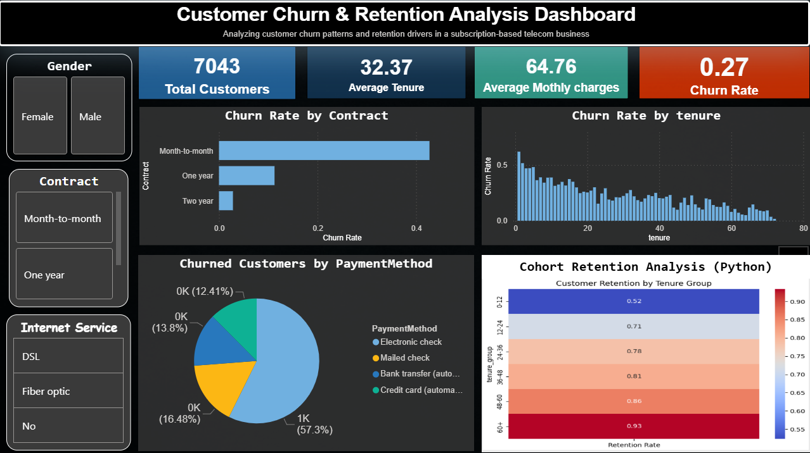

# 📊 Data Science & Analytics Internship Projects (Future Interns)

## 📌 Overview

This repository contains projects completed as part of the **Future Interns Data Science & Analytics Internship Program (2026)**.

Each project focuses on solving real-world business problems using data analysis, visualization, and insights.

---

# 🚀 📁 Projects Included

---

## 🔹 1. Sales Performance Analysis Dashboard

### 📌 Objective

Analyze sales data to track performance, identify trends, and support business decision-making.

### 🛠 Tools Used

* Excel
* Data Visualization

### 📊 Key Highlights

* Sales trends analysis
* KPI tracking dashboard
* Business performance insights

### 🖼 Dashboard Preview


---

## 🔹 2. Customer Churn & Retention Analysis

### 📌 Objective

Analyze customer churn patterns and identify key factors affecting retention in a telecom business.

### 🛠 Tools Used

* Python (Pandas, NumPy, Seaborn)
* Power BI
* Cohort Analysis

### 📊 Key Insights

* Month-to-month customers have highest churn
* Long-term customers show better retention
* Electronic check users churn more
* Fiber optic users show higher churn risk

### 🧠 Advanced Analysis

* Cohort analysis using Python
* Retention heatmap visualization

### 💡 Business Recommendations

* Improve onboarding for new users
* Promote long-term contracts
* Target high-risk customers early
* Build loyalty programs

### 🖼 Dashboard Preview



---

# 📂 Repository Structure

```
FUTURE_DS_01/
│
├── Sales_Analysis_Dashboard/
│   ├── Dataset/
│   ├── Dashboard.png
│   ├── README.md
│   └── Excel File
│
├── Customer_Churn_Analysis/
│   ├── Dataset/
│   ├── churn_analysis.ipynb
│   ├── dashboard.png
│   ├── dashboard.pbix
│   └── README.md
│
└── README.md
```

---

# 🧑‍💻 Author

**Sarthak Sahu**
Aspiring Data Analyst
Skills: SQL | Python | Power BI | Excel

---
