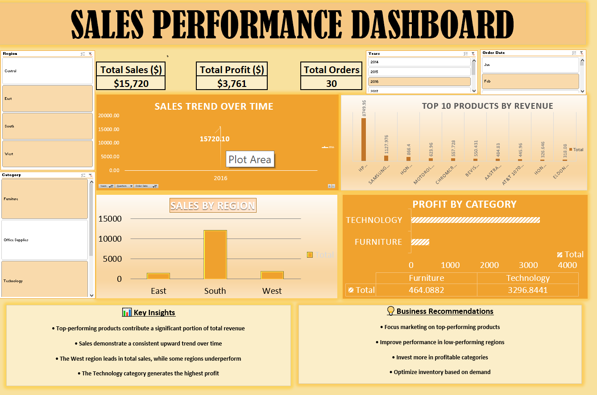

# 📊 Sales Performance Analysis Dashboard

## 🔍 Project Overview
This project analyzes business sales data to identify trends, top-performing products, and growth opportunities.

## 🎯 Objectives
- Identify top revenue-generating products  
- Analyze sales trends over time  
- Evaluate regional and category performance  

## 🛠️ Tools Used
- Microsoft Excel  

## 📊 Dashboard Features
- Total Sales, Profit, Orders (KPIs)  
- Sales Trend Over Time  
- Top 10 Products  
- Sales by Region  
- Profit by Category  
- Interactive Filters (Slicer/Timeline)  

## 📈 Key Insights
- A small group of products contributes most of the revenue  
- Sales show a consistent upward trend  
- The West region leads in sales performance  
- Technology category generates highest profit  

## 💡 Business Recommendations
- Focus marketing on top-performing products  
- Improve performance in low-performing regions  
- Invest more in profitable categories  
- Optimize inventory based on demand  

## 📸 Dashboard Preview

